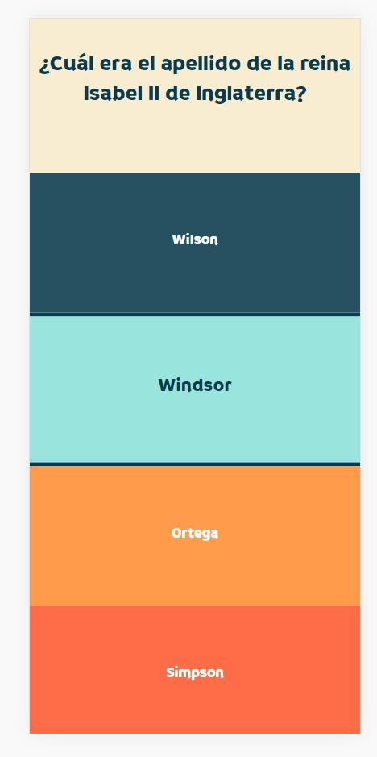
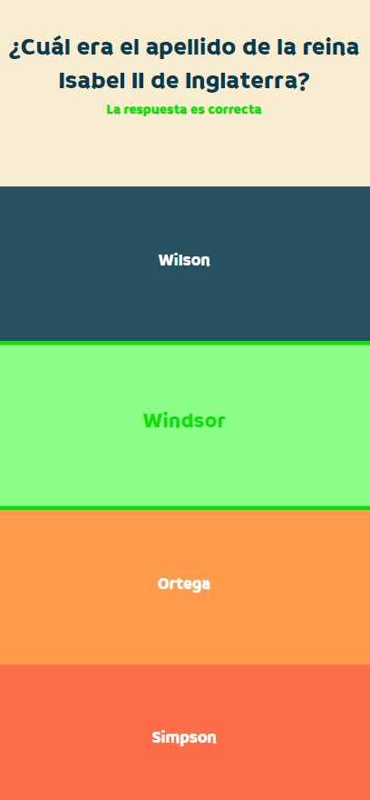
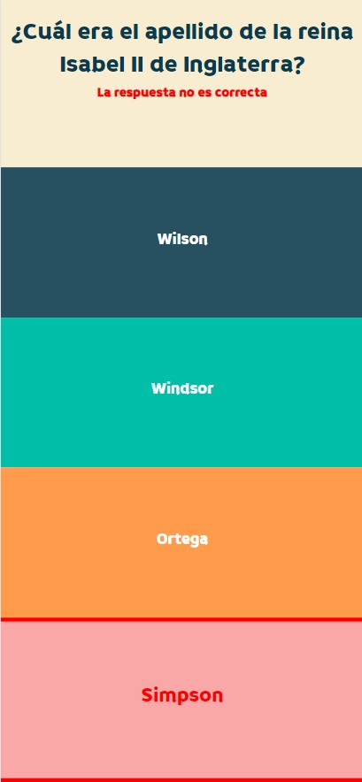
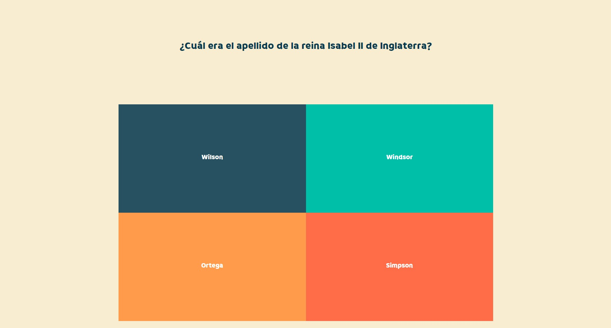

# Quiz form

Proyecto indiviual para crear un juego de preguntas y respuestas múltiples aplicando conocimientos de CSS y Javascript, principalmente estilo y validación de formularios.

## Tabla de contenidos

- [Resumen](#resumen)
  - [Objetivo](#objetivo)
  - [Screenshots](#screenshots)
  - [Links](#links)
- [Proceso](#proceso)
  - [Construido con](#construido-con)
  - [Puntos clave](#puntos-clave)
  - [Falta por desarrollar](#falta-por-desarrollar)

## Resumen

### Objetivo

- El Quiz constará de 10 preguntas. Cada pregunta tendrá 4 opciones y sólo una de ellas será la correcta
- Visualizar un único formulario con 10 preguntas en el navegador (en un mismo documento HTML)
- Cuando hagas "Enviar", se realizará la validación del formulario

Requisitos

- Manipulación dinámica del DOM
- Sin frameworks ni librerias externas en la medida de lo posible
- Gestión del proyecto desde el inicio en un único repositorio en Github. Usar el sistema de ramas, main, develop, etc... como hemos visto en clase
- Código limpio, buenas prácticas
- Documentar bien el README
- Subirlo GitHub Pages y compartid el enlace (y ponedlo en el fichero Readme)

### Screenshots

  

### Links

- Repositorio URL: https://github.com/Radu-A/Radu-A.github.io/tree/master
- Live Site URL: https://radu-a.github.io/

## Proceso

### Construido con

- Semantic HTML5 markup
- CSS
- Flexbox
- Mobile-first workflow
- Javascript

### Puntos clave

Manejo de "radio buttons" en CSS:
- Modificar su apariencia en conjunto con su "label"
- Utillizar la propiedad "checked" para darle animación

Validación más compleja:
- Bloquear la funcionalidad de los "radio buttons" para impedir que el usuario cambie la apariencia de las "label" y así observar solamente si ha acertado o no
- Modificar apariencia de "radio + label" en función de si el usuario ha acertado o no
- Llevar al usuario de vuelta al principio de la página
- Mostrar resultado con el número de respuestas acertadas
- Mostrar un nuevo "button" funcional para dar la posibilidad de repetir el "quiz"

### Falta por desarrollar

- Desplazar la página al siguiente fieldset al seleccionar una opción
- Cargar las preguntas y respuestas desde javascript para permitir escalar el "quiz"